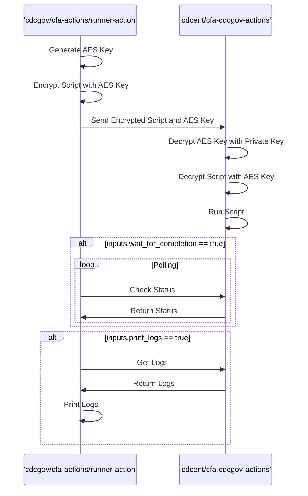

# Runner Action

> [!IMPORTANT] 
> This action is intended for internal use. This action will not work if you use it in a repository outside of [CDCgov](https://github.com/CDCgov) or [CDCent](https://github.com/cdcent).

This action allows you to securely run scripts on the Azure Container App runners in the Azure subscription from public runners. A Github App is required with 'read' permissions for Actions, Contents, and Metadata on the CDCEnt repo [cfa-cdcgov-actions](https://github.com/cdcent/cfa-cdcgov-actions).
If you do not have a GitHub App, you can find an [app id](https://portal.azure.com/#view/Microsoft_Azure_KeyVault/ListObjectVersionsRBACBlade/~/overview/objectType/secrets/objectId/https%3A%2F%2Fcfa-predict.vault.azure.net%2Fsecrets%2Fcfa-cdcgov-actions-app-id/vaultResourceUri/%2Fsubscriptions%2Fef340bd6-2809-4635-b18b-7e6583a8803b%2FresourceGroups%2FEXT-EDAV-CFA-PRD%2Fproviders%2FMicrosoft.KeyVault%2Fvaults%2FCFA-Predict/vaultId/%2Fsubscriptions%2Fef340bd6-2809-4635-b18b-7e6583a8803b%2FresourceGroups%2Fext-edav-cfa-prd%2Fproviders%2FMicrosoft.KeyVault%2Fvaults%2FCFA-Predict) and [pem](https://portal.azure.com/#view/Microsoft_Azure_KeyVault/ListObjectVersionsRBACBlade/~/overview/objectType/secrets/objectId/https%3A%2F%2Fcfa-predict.vault.azure.net%2Fsecrets%2Fcfa-cdcgov-actions-private-key/vaultResourceUri/%2Fsubscriptions%2Fef340bd6-2809-4635-b18b-7e6583a8803b%2FresourceGroups%2FEXT-EDAV-CFA-PRD%2Fproviders%2FMicrosoft.KeyVault%2Fvaults%2FCFA-Predict/vaultId/%2Fsubscriptions%2Fef340bd6-2809-4635-b18b-7e6583a8803b%2FresourceGroups%2Fext-edav-cfa-prd%2Fproviders%2FMicrosoft.KeyVault%2Fvaults%2FCFA-Predict) in the CFA Predict Key Vault.
If you have an existing GitHub App or would like to request a new one, you can reach out to the [CDC GitHub team](mailto:github@cdc.gov).

Behind the scenes, this action encrypts the input script and uses repository_dispatch to pass the script to the cfa-cdcgov-actions repo to run on a self-hosted Azure Container App runner.



The Container App runners have some limitations compared to `ubuntu-latest`, namely the absence of docker and lack of access to `apt-get` for software installation. See the Predict handbook for more info on the [Container App runners](https://github.com/cdcent/cfa-predict-handbook/blob/main/docs/vap-5-Github-actions_runners.md).

## Inputs and Outputs

| Field | Description | Required | Default |
|-------|-------------|----------|---------|
| `github_app_id` | A GitHub App ID installed on CDCEnt | true | |
| `github_app_pem` | The PEM-encoded private key for the GitHub APP| true | |
| `script` | A bash script to be run on the Azure self-hosted runner | true | |
| `wait_for_completion` | true/false option to wait for the dispatched workflow to complete | false | false |
| `print_logs` | true/false option to print the action logs once the workflow has completed | false | false |
| `max_retries` | integer with max number of retries when using wait_for_completion or print_logs | false | 20 |
| `retry_interval` | integer representing the number of seconds between retries | false | 15 |

## Examples and Usage
The script passed to this action is a normal bash script which means marketplace actions can't be used here.

The following example uses the `az acr import` command to pull an image from GHCR to ACR:

```yaml
  acr-import:
    name: Import image from GHCR
    runs-on: ubuntu-latest
    steps:
    - name: ACR Import
      uses: CDCgov/cfa-actions/runner-action@1.0.0 # check cfa-actions repo for latest tag
      with:
        github_app_id: ${{ secrets.CDCENT_ACTOR_APP_ID }}
        github_app_pem: ${{ secrets.CDCENT_ACTOR_APP_PEM }}
        wait_for_completion: true
        print_logs: true
        script: |
          IMAGE_TAG=${{ env.IMAGE_NAME }}:${{ steps.image-tag.outputs.tag }}

          az login --service-principal \
          --username ${{ fromJSON(secrets.AZURE_SERVICE_PRINCIPAL).clientId }} \
          --password ${{ fromJSON(secrets.AZURE_SERVICE_PRINCIPAL).clientSecret }} \
          --tenant ${{ fromJSON(secrets.AZURE_SERVICE_PRINCIPAL).tenantId }}

          az acr import --name ${{ env.REGISTRY }} \
            --source "ghcr.io/cdcgov/$IMAGE_TAG" \
            --username '${{ github.repository_owner }}'\
            --password ${{ secrets.GITHUB_TOKEN }} \
            --image "$IMAGE_TAG" \
            --force && echo 'Copied image!'

          if [ $? -ne 0 ]; then
            echo "Failed to copy image"
          fi
```
With the `wait_for_completion` and `print_logs` parameters set to true, the workflow will enter a polling loop and then print the logs. The logs from the self-hosted runner will be prefixed with a timestamp. Here is what the output for this workflow run would look like:
```
Workflow run status: queued
Waiting for 15 seconds before retrying...
Workflow run status: in_progress
Waiting for 15 seconds before retrying...
Workflow run status: completed
Workflow run completed with conclusion: success
Run GITHUB_TOKEN='***'
Fetching logs from: https://api.github.com/repos/cdcent/cfa-cdcgov-actions/actions/runs/13729339208/logs
Logs have been downloaded and unzipped to the run_logs directory.
Run # decrypt AES key using RSA private key
2025-03-07T21:09:54.2034431Z [
2025-03-07T21:09:54.2040343Z   ***
2025-03-07T21:09:54.2041331Z     "cloudName": "AzureCloud",
2025-03-07T21:09:54.2042427Z     "homeTenantId": "<redacted>",
2025-03-07T21:09:54.2047074Z     "id": "<redacted>",
2025-03-07T21:09:54.2053012Z     "isDefault": true,
2025-03-07T21:09:54.2053992Z     "managedByTenants": [
2025-03-07T21:09:54.2054822Z       ***
2025-03-07T21:09:54.2055691Z         "tenantId": "<redacted>"
2025-03-07T21:09:54.2056638Z       ***
2025-03-07T21:09:54.2057360Z     ],
2025-03-07T21:09:54.2058150Z     "name": "EXT-EDAV-CFA-PRD",
2025-03-07T21:09:54.2059013Z     "state": "Enabled",
2025-03-07T21:09:54.2059963Z     "tenantId": "<redacted>",
2025-03-07T21:09:54.2061020Z     "user": ***
2025-03-07T21:09:54.2061893Z       "name": "<redacted>",
2025-03-07T21:09:54.2062871Z       "type": "servicePrincipal"
2025-03-07T21:09:54.2063699Z     ***
2025-03-07T21:09:54.2064406Z   ***
2025-03-07T21:09:54.2065705Z ]
2025-03-07T21:09:54.8360735Z WARNING: The login server endpoint suffix '.azurecr.io' is automatically omitted.
2025-03-07T21:10:06.2097970Z Copied image!
```
If you have existing scripts in your repository, you can access them by using `git clone` in your script:
```yaml
  run-script:
    name: Run a script from the repo
    runs-on: ubuntu-latest
    steps:
    - name: Run Script
      uses: CDCgov/cfa-actions/runner-action@1.0.0 # check cfa-actions repo for latest tag
      with:
        github_app_id: ${{ secrets.CDCENT_ACTOR_APP_ID }}
        github_app_pem: ${{ secrets.CDCENT_ACTOR_APP_PEM }}
        wait_for_completion: true
        print_logs: true
        script: |
          git clone https://github.com/${{ github.repository }}.git

          cd repo-name

          chmod +x hello_world.sh
          ./hello_world.sh
``` 
