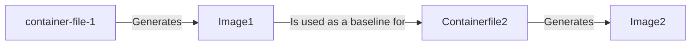
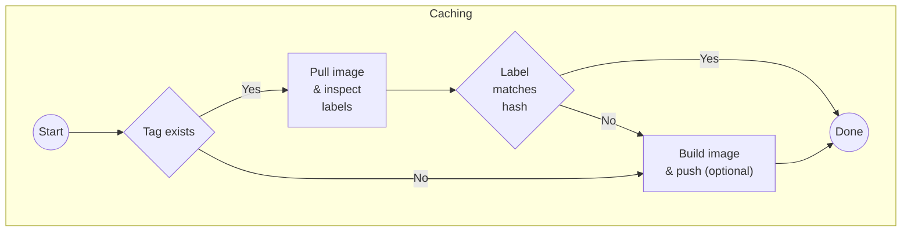

# Build image in two steps: Caching dependencies

This action will build a container image for a project in two steps and push the image to a container registry. During the first step, using the container file `container-file-1`, it will build and cache the image containing the dependencies of the main project. After the first step, a second build and push process happens based on the container file `container-file-2`. The `container-file-2` uses as base image the one created during the first step.



The bulk of the action is dealing with whether the first image is available or not. If available, the action will check if the cache key matches the hash of the container file. If it does, the action will skip the first step and use the cached image. If the cache key does not match, the action will build the image and push it to the registry (if `push-image-1` is set to `true`):



Caching is done by storing the cache-key as a label in the image (`TWO_STEP_BUILD_CACHE_KEY`); and the build and push process is done using the [docker/build-push-action@v6](https://github.com/docker/build-push-action/tree/v6) action. Users have to explicitly provide the cache key for the first step. For example, if you are dealing with an R package, you can cache the dependencies by passing the key `${{ hashFiles('DESCRIPTION') }}` to the `first-step-cache-key` input. That way, the first step will only be executed if the dependencies change.

## Inputs and Outputs

| Field | Description | Required | Default |
|-------|-------------|----------|---------|
| `container-file-1` | Path to the first container file | true | |
| `container-file-2` | Path to the second container file | true | |
| `first-step-cache-key` | Cache key for the first step | true | |
| `image` | Name of the image | true | |
| `registry` | Registry to push the image to | true |  |
| `username` | Username for the registry | false |  |
| `password` | Password for the registry | false |  |
| `main-branch-name` | Name of the main branch | false | `'main'` |
| `main-branch-tag` | Tag to use for the main branch | false | `'latest'` |

The following are arguments passed to the [docker/build-push-action@v6](https://github.com/docker/build-push-action/tree/v6) action.

| Field | Description | Required | Default |
|-------|-------------|----------|---------|
| `push-image-1` | Push the image created during the first step | false | `false` |
| `push-image-2` | Push the image created during the second step | false | `false` |
| `build-args-1` | Build arguments for the first step | false | |
| `build-args-2` | Build arguments for the second step | false | |
| `labels-1` | Labels for the first step | false | |
| `labels-2` | Labels for the second step | false | |

The action has the following outputs:

| Field | Description |
|-------|-------------|
| `tag` | Container tag of the built image |
| `branch` | Branch name |
| `summary` | A summary of the action: (`built`, `re-built`, or `cached`) |


## Example: using the Azure container registry
It is possible to log in by providing an explicit azure container registry username and password, but for CFA use we recommend a service principal-mediated login approach on a self-hosted runner. Here is an example, based on a [real workflow](https://github.com/CDCgov/pyrenew-hew/blob/main/.github/workflows/containers.yaml) from the [`pyrenew-hew`](https://github.com/cdcgov/pyrenew-hew) repo. You'll first need to create a valid [creds string](https://github.com/Azure/login?tab=readme-ov-file#creds) for your Azure Service Principal and store it as a repo secret. In this example, we've named the secret `MY_SERVICE_PRINCIPAL_CREDS_STRING`.

```yaml
name: Create Docker Image

on:
  push:
    branches: [main]
  pull_request:
  workflow_dispatch:

env:
  IMAGE_NAME: example-image-name
  CONTAINER_REGISTRY_NAME: myacrregistry

jobs:

  build-and-push-image:
    runs-on: cfa-cdcgov
    name: Build and push image

    steps:
      - name: Login to Azure
        id: azure_login_2
        uses: azure/login@v2
        with:
          creds: ${{ secrets.MY_SERVICE_PRINCIPAL_CREDS_STRING }}

      - name: Login to ACR
        run: az acr login --name ${{ env.CONTAINER_REGISTRY_NAME }}
        
      - name: Build and push image
        id: build-push
        uses: CDCgov/cfa-actions/twostep-container-build@v1.2.1
        with:
          container-file-1: ./Containerfile.dependencies
          container-file-2: ./Containerfile
          first-step-cache-key: docker-dependencies-${{ runner.os }}-${{ hashFiles('./Containerfile.dependencies') }}
          image: ${{ env.IMAGE_NAME }}
          registry: $${ env.CONTAINER_REGISTRY_NAME }}.azurecr.io/
          build-args-2: |
            TAG=${{ steps.image.outputs.tag }}
            GIT_COMMIT_SHA=${{ github.event.pull_request.head.sha || github.sha }}
            GIT_BRANCH_NAME=${{ steps.branch.outputs.name }}
```

## Example: Using ghcr.io

The workflow is triggered on pull requests and pushes to the main branch. The image is pushed to `ghcr.io` and the image name is `cdcgov/cfa-actions` (full name is `ghcr.io/cdcgov/cfa-actions`). A functional version of this workflow is executed [here](../.github/workflows/test-twostep-container-build.yml).

```yaml
name: Building the container and put it on ghcr.io

on:
  pull_request:
    branches: [main]
  push:
    branches: [main]

jobs:
  test:
    runs-on: ubuntu-latest

    # Since we are using ghcr.io, we need to set the permissions to write
    # for the packages.
    permissions:
      contents: read
      packages: write
      pull-requests: write

    steps:
      - uses: actions/checkout@v4
        name: Checkout code

      - name: Two-step build
        uses: CDCgov/cfa-actions/twostep-container-build@v1.2.0
        with:
          # Login information
          registry: ghcr.io/
          username: ${{ github.actor }}
          password: ${{ secrets.GITHUB_TOKEN }}

          # Paths to the container files
          container-file-1: Containerfile.dependencies
          container-file-2: Containerfile

          # We are using the dependency container for caching
          first-step-cache-key: ${{ hashFiles('Containerfile.dependencies') }}

          # The image to build includes the organization (that's how it is
          # on ghcr.io)
          image: cdcgov/cfa-actions

```

The container files (which can be found under the [examples](examples) directory) have the following structure:

[`Containerfile.dependencies`](examples/Containerfile.dependencies)

```Containerfile
FROM rocker/r-base:4.4.0

RUN install2.r epiworldR

CMD ["bash"]
```

[`Containerfile`](examples/Containerfile)

```Containerfile
# Collection of ARGs
ARG TAG=dependencies-latest
ARG IMAGE=ghcr.io/cdcgov/cfa-actions
ARG GH_SHA=default_var

FROM ${IMAGE}:${TAG}

# Re-declaring the ARGs here is necessary to use them in the LABEL
ARG GH_SHA
LABEL GH_SHA=${GH_SHA}

COPY . /app/.
CMD ["bash"]
```

Notice the `TAG` argument which is passed to the second container file. During runs of the action, `TAG` takes the value of the `dependencies-[branch name]` or `dependencies-latest` if the branch is the main branch.
