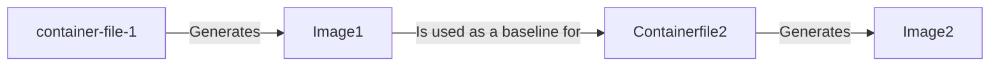

# Build image in two steps: Caching dependencies

This action will build a container image for a project in two steps and push the image to a container registry. During the first step, using the container file `container-file-1`, it will build and cache the image containing the dependencies of the main project. After the first step, a second build and push process happens based on the container file `container-file-2`. The `container-file-2` uses as base image the one created during the first step.



Caching is done using the [actions/cache](https://github.com/actions/cache/tree/v4) (lookup only) and [docker/build-push-action](https://github.com/docker/build-push-action) actions. Users have to explicitly provide the cache key for the first step. For example, if you are dealing with an R package, you can cache the dependencies by passing the key `${{ hashFiles('DESCRIPTION') }}` to the `first-step-cache-key` input. That way, the first step will only be executed if the dependencies change.

## Inputs

| Field | Description | Required | Default |
|-------|-------------|----------|---------|
| `container-file-1` | Path to the first container file | true | |
| `container-file-2` | Path to the second container file | true | |
| `first-step-cache-key` | Cache key for the first step | true | |
| `image` | Name of the image | true | |
| `username` | Username for the registry | true |  |
| `password` | Password for the registry | true |  |
| `registry` | Registry to push the image to | true |  |
| `main-branch-name` | Name of the main branch | false | `'main'` |
| `main-branch-tag` | Tag to use for the main branch | false | `'latest'` |

The following are arguments passed to the [docker/build-push-action](https://github.com/docker/build-push-action) action.

| Field | Description | Required | Default |
|-------|-------------|----------|---------|
| `push-image-1` | Push the image created during the first step | false | `false` |
| `push-image-2` | Push the image created during the second step | false | `false` |
| `build-args-1` | Build arguments for the first step | false | |
| `build-args-2` | Build arguments for the second step | false | |
| `docker-login-action` | Version of the [docker/login-action](https://github.com/docker/login-action) to use | false | `'v3'` |
| `docker-build-push-action` | Version of the [docker/build-push-action](https://github.com/docker/build-push-action) to use | false | `'v6'` |


## Example: Using ghcr.io

The workflow is triggered on pull requests and pushes to the main branch. The image is pushed to `ghcr.io` and the image name is `cdcgov/cfa-actions` (full name is `ghcr.io/cdcgov/cfa-actions`). A functional version of this workflow is executed [here](../.github/workflows/test-twostep-container-build.yml).

```yaml
name: Building the container and put it on ghcr.io

on:
  pull_request:
    branches: [main]
  push:
    branches: [main]

jobs:
  test:
    runs-on: ubuntu-latest

    # Since we are using ghcr.io, we need to set the permissions to write
    # for the packages.
    permissions:
      contents: read
      packages: write
      pull-requests: write

    steps:
      - uses: actions/checkout@v4
        name: Checkout code

      - name: Two-step build
        uses: CDCgov/cfa-actions/twostep-container-build@v1.0.1
        with:
          # Login information
          registry: ghcr.io/
          username: ${{ github.actor }}
          password: ${{ secrets.GITHUB_TOKEN }}

          # Paths to the container files
          container-file-1: Containerfile.dependencies
          container-file-2: Containerfile

          # We are using the dependency container for caching
          first-step-cache-key: ${{ hashFiles('Containerfile.dependencies') }}

          # The image to build includes the organization (that's how it is
          # on ghcr.io)
          image: cdcgov/cfa-actions

```

The container files (which can be found under the [examples](examples) directory) have the following structure:

[`Containerfile.dependencies`](examples/Containerfile.dependencies)

```Containerfile
FROM rocker/r-base:4.4.0

RUN install2.r epiworldR

CMD ["bash"]
```

[`Containerfile`](examples/Containerfile)

```Containerfile
ARG TAG=latest

FROM ghcr.io/cdcgov/cfa-actions:${TAG}

COPY twostep-container-build/example/Containerfile /app/.

CMD ["bash"]
```

Notice the `TAG` argument which is passed to the second container file. During runs of the action, `TAG` takes the value of the branch name or `latest` if the branch is the main branch.