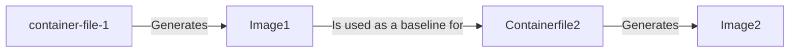

# Build image in two steps

This action will build a container image for a project in two steps and push the image to a container registry. During the first step, using the container file `container-file-1`, it will build and cache the image containing the dependencies of the main project. After the first step, a second build and push process happens based on the container file `container-file-2`. The `container-file-2` uses as base image the one created during the first step.



## Inputs

| Field | Description | Required | Default |
|-------|-------------|----------|---------|
| `container-file-1` | Path to the first container file | true | |
| `container-file-2` | Path to the second container file | true | |
| `first-step-cache-key` | Cache key for the first step | true | |
| `image` | Name of the image | true | |
| `username` | Username for the registry | false | `''` |
| `password` | Password for the registry | false | `''` |
| `registry` | Registry to push the image to | false | `''` |
| `main-branch-name` | Name of the main branch | false | `'main'` |
| `main-branch-tag` | Tag to use for the main branch | false | `'latest'` |

## Example: CFA epinow2

```yaml
- uses: CDCgov/cfa-actions/twostep-container-build@v1.1.0
  with:
    container-file-1: ./Containerfile.dependencies
    container-file-2: ./Containerfile
    first-step-cache-key: ${{ hashFiles('**/requirements*.txt') }}
    registry: ghcr.io
    image: CDCgov/cfa-actions-two-step-build
```

Possible contents of `Containerfile.dependencies`:

```Dockerfile
FROM rocker/r-ver:4.4.0

RUN install2.r devtools Rcpp tidyverse

CMD ["BASH"]
```

Possible contents of `Containerfile`:

```Dockerfile
ARG TAG=latest
FROM ghcr.io/CDCgov/cfa-actions-two-step-build:${{TAG}}

RUN R CMD INSTALL .

CMD ["BASH"]
```